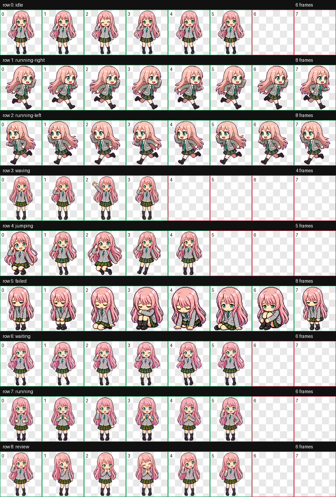

# Pink Signal

English | [中文](#中文)

A pink-haired chibi companion for Codex.

Pink Signal is a custom Codex pet packaged for quick local import. It includes
the pet manifest, a transparent WebP spritesheet, Windows/macOS installers, and
the QA contact sheet used to inspect the animation rows.



## Install

Download the latest release:

<https://github.com/latencyong-design/pink-signal-codex-pet/releases>

Windows:

1. Download `pink-signal-codex-pet-windows-v*.zip`.
2. Extract it.
3. Double-click `install.bat`.

macOS:

1. Download `pink-signal-codex-pet-macos-v*.tar.gz`.
2. Extract it.
3. Double-click `install.command`.

Terminal install:

```powershell
powershell -ExecutionPolicy Bypass -File .\scripts\install.ps1
```

```bash
./scripts/install.sh
```

The installer copies the pet into:

```text
<home>/.codex/pets/pink-signal
```

If `CODEX_HOME` is set, it installs into:

```text
$CODEX_HOME/pets/pink-signal
```

Restart Codex if the pet list does not refresh immediately.

## Package

```text
package/
  pet.json
  spritesheet.webp
```

The spritesheet is `1536x1872`, RGBA WebP, using `192x208` cells.

## Uninstall

Windows:

```powershell
powershell -ExecutionPolicy Bypass -File .\scripts\uninstall.ps1
```

macOS:

```bash
./scripts/uninstall.sh
```

## Notice

Pink Signal is an unofficial fan-made Codex pet. It is not affiliated with,
endorsed by, or sponsored by any third-party rights holder.

## License

See [LICENSE.md](LICENSE.md).

---

## 中文

[English](#pink-signal) | 中文

Pink Signal 是一个粉色长发 chibi 风格的 Codex 小宠物。

这个仓库提供干净的 Codex pet 包、一键导入脚本、透明 WebP spritesheet，以及用于检查
动画行的 QA contact sheet。


## 安装

下载最新 Release：

<https://github.com/latencyong-design/pink-signal-codex-pet/releases>

Windows：

1. 下载 `pink-signal-codex-pet-windows-v*.zip`。
2. 解压。
3. 双击 `install.bat`。

macOS：

1. 下载 `pink-signal-codex-pet-macos-v*.tar.gz`。
2. 解压。
3. 双击 `install.command`。

命令行安装：

```powershell
powershell -ExecutionPolicy Bypass -File .\scripts\install.ps1
```

```bash
./scripts/install.sh
```

安装脚本会把宠物复制到：

```text
<home>/.codex/pets/pink-signal
```

如果设置了 `CODEX_HOME`，则安装到：

```text
$CODEX_HOME/pets/pink-signal
```

如果 Codex 宠物列表没有立即刷新，请重启 Codex。

## 包内容

```text
package/
  pet.json
  spritesheet.webp
```

spritesheet 是 `1536x1872`、RGBA WebP，单元格尺寸为 `192x208`。

## 卸载

Windows：

```powershell
powershell -ExecutionPolicy Bypass -File .\scripts\uninstall.ps1
```

macOS：

```bash
./scripts/uninstall.sh
```

## 声明

Pink Signal 是非官方 fan-made Codex pet。它不隶属于任何第三方权利方，也未获得任何
第三方权利方赞助或背书。

## 许可证

见 [LICENSE.md](LICENSE.md)。
